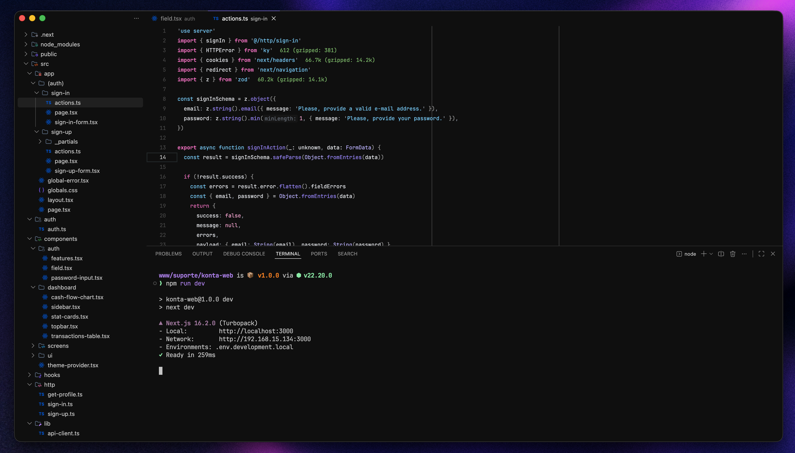

<!-- BANNER AMBS -->

  

<h1 align="center">Vesper AMBS</h1>

  Uma releitura do Vesper com identidade AMBS. 
  Foco em contraste equilibrado, conforto visual e produtividade real.

  <a href="https://marketplace.visualstudio.com/items?itemName=Caiolandgraf.vesper-ambs">
    <strong>Install →</strong>
  </a>

---

## ✨ Sobre

**Vesper AMBS** é uma evolução do tema original inspirado no  
[Vesper++](https://github.com/ObstinateM/vesperpp), trazendo:

- 🎯 Melhor hierarquia de cores
- 🧠 Leitura confortável por longas sessões
- 🎨 Paleta refinada baseada no wallpaper AMBS
- ⚡ Destaque inteligente para keywords e estrutura

---

## 🎨 Preview

  

---

---

## 🎨 Paleta de Cores

| Uso                | Cor        | Preview |
|--------------------|-----------|--------|
| Background         | `#0C0C0C` |  |
| Foreground         | `#E5E7EB` |  |
| Keywords           | `#F87171` |  |
| Functions          | `#A78BFA` |  |
| Variables          | `#7DD3FC` |  |
| Strings            | `#86EFAC` |  |
| Numbers & Booleans | `#F9A8D4` |  |
| Types              | `#C4B5FD` |  |
| Comments           | `#6B7280` |  |

---

## 🧩 Destaques

- 🔴 Keywords com destaque equilibrado (`import`, `return`, etc)
- 🟣 Funções com identidade visual consistente
- 🔵 Declarações (`const`, `let`) mais suaves
- 🟢 Strings legíveis sem poluir
- ⚪ Comentários discretos e elegantes
- 🧊 Inlay hints neutros (sem distração)

---

## 🚀 Filosofia

> Um tema não deve chamar atenção.  
> Ele deve deixar **seu código** chamar.

---

## 🙌 Créditos

Baseado no trabalho incrível de:

- [Vesper](https://github.com/raunofreiberg/vesper)  
- [Vesper++](https://github.com/ObstinateM/vesperpp)

---

  Com 💜 Rocketseat AMBS

